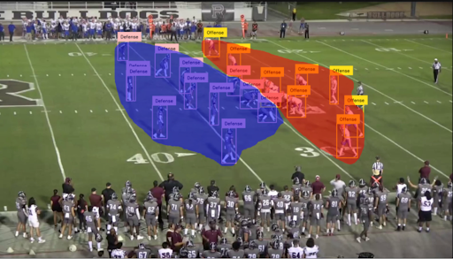
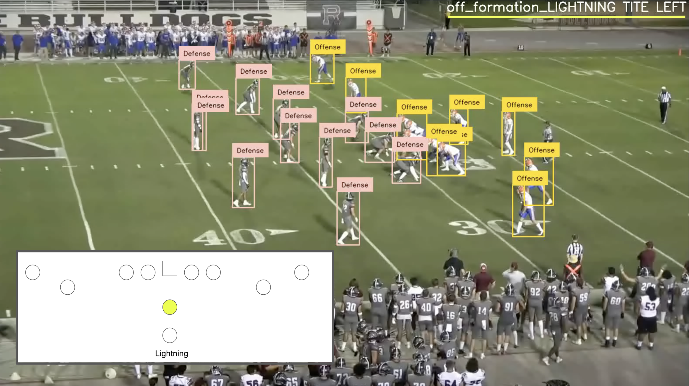

# P-NXTPlay

**P-NXTPlay** is a machine learning incubator project developed through P-ai in collaboration with the Pomona-Pitzer Football program. The goal was to automate the detection of offensive formations from practice footage, using computer vision and spatial data to streamline coaching workflows. This repository contains sample notebooks and materials from the project.

## Project Overview

The primary objective was to reduce the manual effort coaches invest in tagging and labeling plays. By implementing a machine learning pipeline, we sought to:

- Automatically identify offensive formations
- Help analyze tendencies by formation
- Provide actionable, time-saving insights to coaching staff

Our model achieved a 3x improvement over fall 2023 testing, correctly classifying formations for the majority of plays in the test sample, despite limited data and compututation resources.

## Technical Approach

The project was structured into three key stages:

### 1. Field Segmentation

`FieldSegmentation.ipynb`

We used image preprocessing to locate the field and establish a coordinate system to later map player positions accurately.

---

### 2. Player Detection & Team Labeling

`DetectPlayersAndLabelOffenseAndDefense.ipynb`

We applied computer vision techniques to detect player bounding boxes and classify them as offensive or defensive using color/position heuristics.

---

### 3. Formation Detection

`FormationDetection.ipynb`

We trained a convolutional neural network using PyTorch that predicts formation labels from 3D arrays representing offensive player coordinates.

## Repository Contents

- `FieldSegmentation.ipynb`: Field segmentation from practice footage  
- `DetectPlayersAndLabelOffenseAndDefense.ipynb`: Player detection and team labeling  
- `FormationDetection.ipynb`: Neural network for formation prediction  
- `initialData.csv`: Raw HUDL data  
- `simplifiedDataWithCoordinates.csv`: Labeled player positions and formations  
- `largeModel.pt`: Trained PyTorch model

