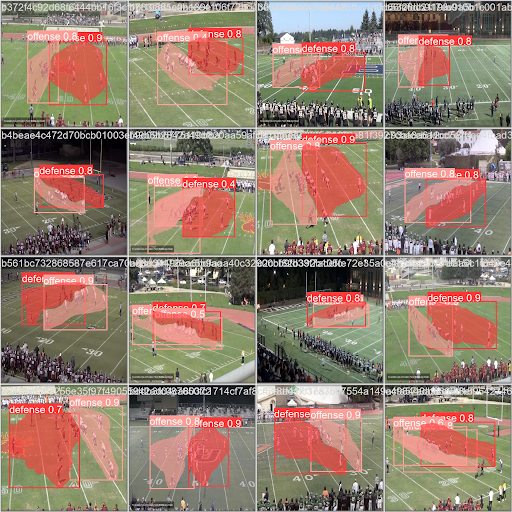

# P-NXTPlay

**P-NXTPlay** is a machine learning incubator project developed through P-ai in collaboration with the Pomona-Pitzer Football program. The goal was to automate the detection of offensive formations from practice footage, using computer vision and spatial data to streamline coaching workflows. This repository contains sample notebooks and materials from the project.

## Project Overview

The primary objective was to reduce the manual effort coaches invest in tagging and labeling plays. By implementing a machine learning pipeline, we sought to:

- Automatically identify offensive formations
- Help analyze tendencies by formation
- Provide actionable, time-saving insights to coaching staff

Our MVP achieved over 50% accuracy, a 3× improvement over fall 2023 testing, despite limited data and compututation resources.

## Technical Approach

The project was structured into three key stages:

### 1. Field Segmentation

We used image preprocessing to locate the field and establish a coordinate system to later map player positions accurately.

---

### 2. Player Detection & Team Labeling

We applied computer vision techniques to detect player bounding boxes and classify them as offensive or defensive using color/position heuristics.

---

### 3. Formation Detection

We trained a neural network using PyTorch that predicts formation labels from simplified XY coordinate arrays representing offensive player alignment.

## Technical Approach

Our pipeline included several key stages:

1. **Field Segmentation**  
   `FieldSegmentation.ipynb` processes raw footage to delineate the playing field, laying the groundwork for accurate player detection.

2. **Player Detection and Labeling**  
   `DetectPlayersAndLabelOffenseAndDefense.ipynb` uses computer vision to locate players and distinguish offensive from defensive units.

3. **Formation Detection**  
   `FormationDetection.ipynb` builds a neural network model that ingests player coordinates and predicts offensive formations.

## Results

Despite limited data and computational resources, we developed an MVP model capable of detecting offensive formations over approximately 50% accuracy—a threefold improvement over baseline testing from Fall 2023.

### Sample Output

## Repository Contents

- `FieldSegmentation.ipynb`: Field segmentation from practice footage  
- `DetectPlayersAndLabelOffenseAndDefense.ipynb`: Player detection and team labeling  
- `FormationDetection.ipynb`: Neural network for formation prediction  
- `initialData.csv`: Raw HUDL data  
- `simplifiedDataWithCoordinates.csv`: Labeled player positions and formations  
- `largeModel.pt`: Trained PyTorch model

